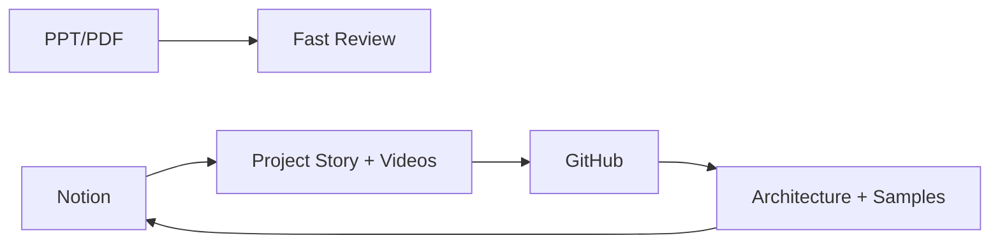
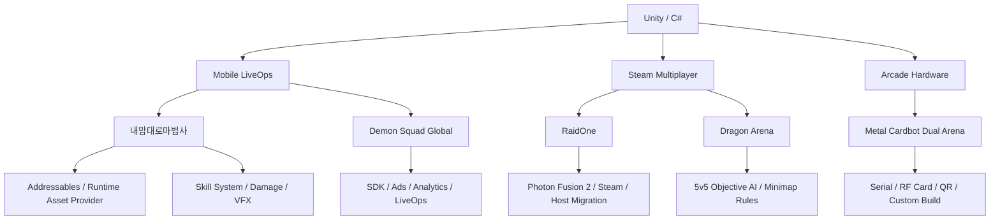

# Architecture Overview

This document summarizes the public-safe architecture story behind the portfolio projects.

## Portfolio Split



## Project Domains



## Mobile LiveOps Pattern

```text
App Launch
  -> Version / Remote Config
  -> Server User Data
  -> Google Sheet or Local Runtime Data
  -> Runtime Assets
  -> Lobby / Outgame
  -> Stage / Battle
```

The mobile projects focus on reducing operational friction. Data can be updated from sheets or server responses, loading progress is visible to the player, and SDK-heavy features are isolated from the core gameplay loop.

## Multiplayer Pattern

```text
Steam Entry
  -> Lobby / Session
  -> Photon Fusion Runner
  -> Networked Player / Monster / Objective
  -> RPC Damage / Status / Result
  -> Migration or Reconnect Recovery
```

RaidOne and Dragon Arena share a network-first mindset. Combat objects are structured around authority, replicated state, and recovery after host changes.

## Arcade Hardware Pattern

```text
Mode Scene
  -> Google Sheet Data
  -> QR / Card Data
  -> Serial Device
  -> Payment / Card Dispense
  -> Battle
  -> Score / Ranking
```

Metal Cardbot Dual Arena is different from a normal PC game because the client must synchronize with physical devices. Serial responses, card dispense states, and timeouts are part of the gameplay flow.

## Why The Samples Exist

The original projects include private assets, paid SDK configuration, server endpoints, and team-owned code. The sample code in this repository is rewritten to demonstrate:

- How I separate loading, data, resources, and gameplay stages
- How I centralize damage and hit resolution instead of duplicating it per skill
- How I reduce mobile allocations with NonAlloc queries
- How I think about network session recovery and hardware state machines
- How I build editor tools to remove repetitive manual work

