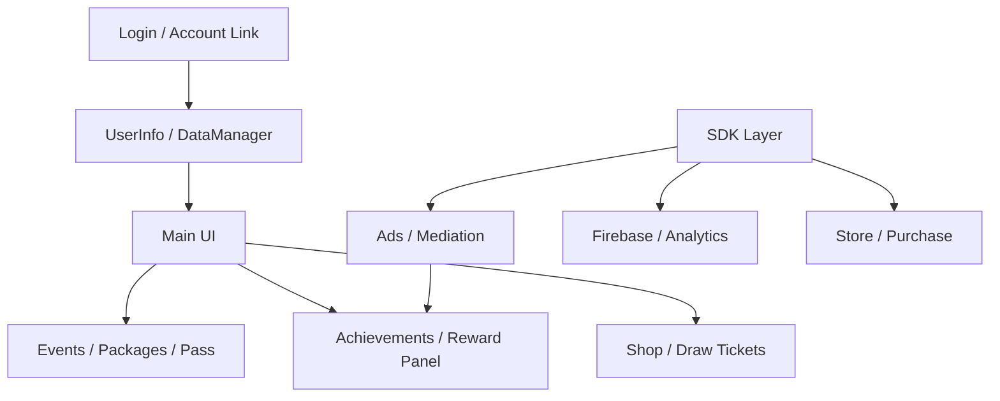

# Demon Squad Global

Global maintenance and feature-update project for an already released mobile idle RPG.

## Role

Solo maintenance and global response. The original game was not built by me from scratch; my responsibility was to keep the production project shippable while adding SDKs, features, and optimization.

## Main Responsibilities

- Existing project analysis and maintenance
- SDK, ads, analytics, notification, and store integration
- LiveOps event, package, reward, and achievement UI additions
- Localization text integration
- Build and store-response work
- Performance and stability fixes

## Service Flow

## Code Evidence

- `Assets/2_Scripts`: many feature folders for events, rewards, achievements, packages, and UI panels
- `LocalizationService` usage across UI text
- Firebase, GoogleMobileAds, LevelPlay, GPM, and other service packages in the project
- Editor scripts for build/key/Xcode support

## Representative Code Samples

- `Samples/LiveOps/RewardAdDailyGrantSample.cs`

