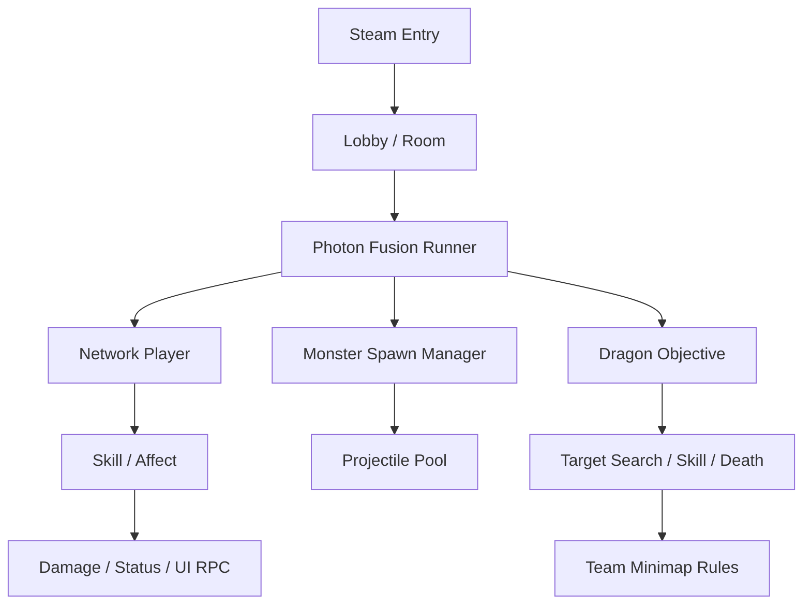

# Dragon Arena

Steam PC 5v5 MOBA project expanded from the RaidOne codebase.

## Role

Main developer. Estimated contribution: about 60%.

## Main Responsibilities

- Photon Fusion 2 multiplayer combat extension
- Team-based objective flow
- Dragon and raid-objective AI
- Networked monster spawn, summon, projectile pooling
- Minimap visibility rules and objective notifications
- Steam release-oriented lobby/session flow

## Runtime Flow

## Code Evidence

- `AI/Dragon.cs`: networked dragon state, target selection, attacks, damage, death sequence
- `Enemy/MonsterSpawnManager.cs`: safe spawn position, network spawn, summon, raid monster handling
- `Affect/*`: status effect process and migration rebind flow
- `Manager/InputManager.cs`: input mapping, minimap, inventory, skill slots

## Representative Code Samples

- `Samples/Networking/FusionSessionRecoverySample.cs`
- `Samples/Skills/SkillDamageResolverSample.cs`

