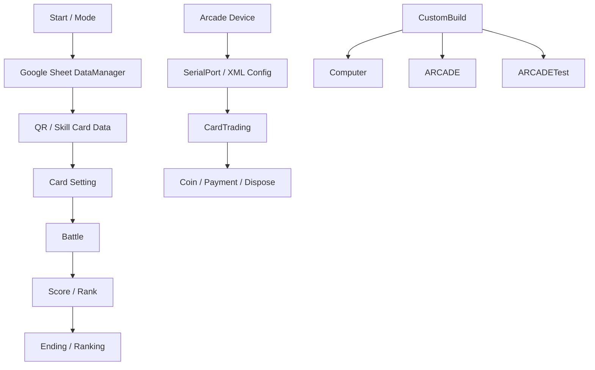

# Metal Cardbot Dual Arena

Unity arcade hardware game with RF card, QR, serial device, and custom build flow.

## Role

Main developer. Estimated contribution: about 60%.

## Main Responsibilities

- RF card and QR data flow
- SerialPort card dispense/payment device integration
- Google Sheet based game data loading
- Battle score and rank calculation
- Computer, Arcade, and ArcadeTest build menus
- Real device play-flow handling

## Runtime Flow

## Code Evidence

- `CardTrading.cs`: SerialPort, XML config, card dispense/payment flow
- `CardTest.cs`: QR scan to game card data
- `DataManager.cs`: Google Sheet TSV loading for stage, monster, skill, QR, sound, level data
- `BattleCalculator.cs`: combo, damage, time, HP score/rank calculation
- `Editor/CustomBuild.cs`: separated build menus and defines

## Representative Code Samples

- `Samples/Hardware/ArcadeCardDeviceFlowSample.cs`

