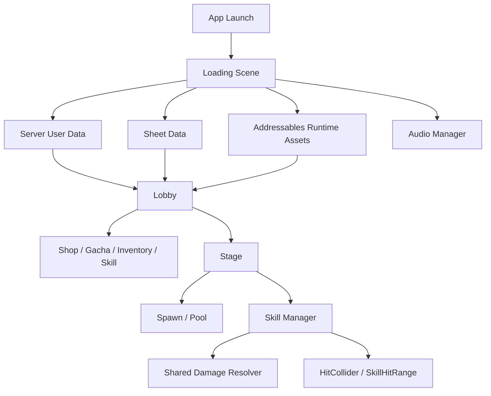

# 내맘대로마법사

Mobile hack-and-slash project built with Unity URP.

## Role

Developer, planner, and team lead. Estimated contribution: about 70%.

## Main Responsibilities

- Lobby and most outgame features
- Shop, gacha, IAP, rewarded ads, resource purchase sounds and feedback
- Equipment inventory, equip/unequip, upgrade success/failure, trait upgrade
- Server data and Google Sheet data loading flow
- Addressables-based portfolio resource structure
- Firebase Remote Config version/update flow
- Unity editor tools for data import, runtime asset catalog, custom Android build
- Skill manager, skill interface, damage resolver, VFX, shader work
- Mobile profiling and stage optimization

## Runtime Flow

## Representative Code Samples

- `Samples/RuntimeAssets/RuntimeAssetProviderSample.cs`
- `Samples/Loading/LoadingProgressPresenterSample.cs`
- `Samples/Skills/SkillDamageResolverSample.cs`
- `Samples/Skills/LightningTurretSkillSample.cs`
- `Samples/Skills/StoneBulletSkillSample.cs`
- `Samples/Optimization/EnemySeparationNonAllocSample.cs`

