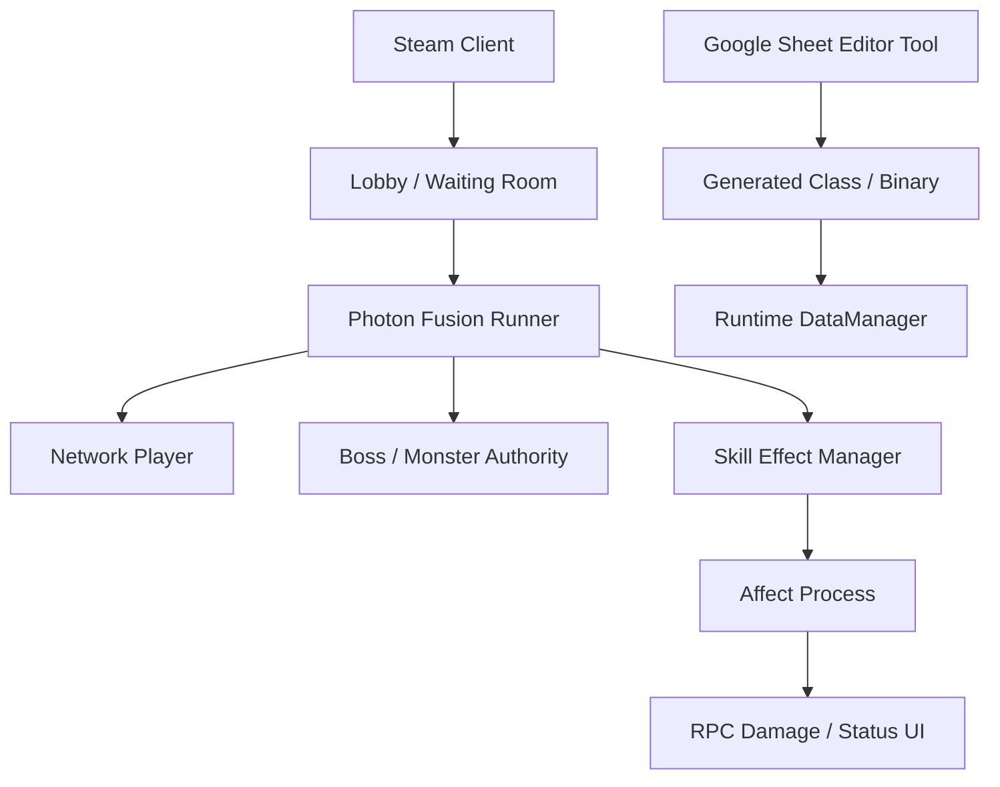

# RaidOne

Steam PC 1v5 boss raid project using Photon Fusion 2.

## Role

Main developer. Estimated contribution: about 60%.

## Main Responsibilities

- Photon Fusion 2 player, monster, skill, and affect structure
- Steam lobby, waiting room, invite, room flow
- Host Migration and session recovery considerations
- Boss/monster combat, skill effects, status effects, damage sync
- Google Sheet to generated C# class/binary editor tooling
- Key binding, minimap, in-game UI, audio mixer structure

## Runtime Flow

## Code Evidence

- `Editor/WS/StructFromCSVGenerator.cs`: sheet index, generated class, generated binary
- `Manager/LocalizationManager.cs`: sheet CSV download and local fallback
- `Enemy/MonsterSpawnManager.cs`: StateAuthority spawn and summon flow
- `Affect/*`: status process and migration handling
- `Manager/AudioManager.cs`: separated lobby/ingame BGM, SFX, UI mixer channels

## Representative Code Samples

- `Samples/Networking/FusionSessionRecoverySample.cs`
- `Samples/EditorTools/AndroidBuildPipelineSample.cs`

