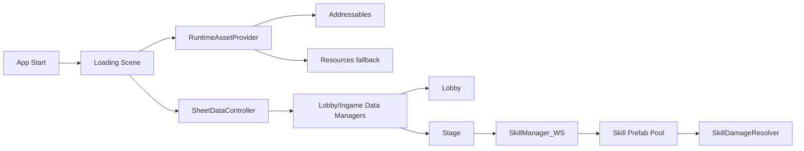
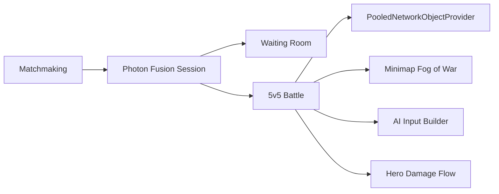
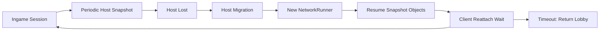
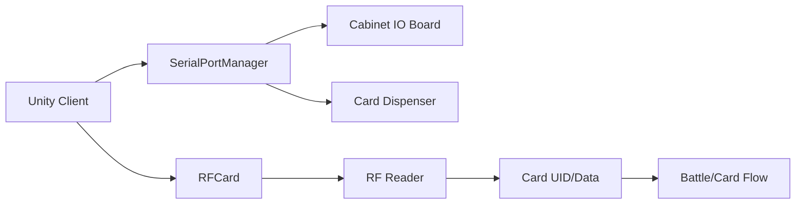
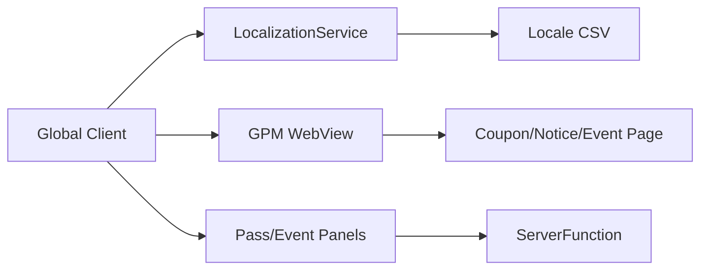

# 프로젝트별 구조 요약

## 내맘대로마법사

```mermaid
flowchart LR
    AppStart["App Start"] --> Loading["Loading Scene"]
    Loading --> Sheet["SheetDataController"]
    Loading --> RuntimeAssets["RuntimeAssetProvider"]
    RuntimeAssets --> Addressables["Addressables"]
    RuntimeAssets --> Resources["Resources fallback"]
    Sheet --> DataManagers["Lobby/Ingame Data Managers"]
    DataManagers --> Lobby["Lobby"]
    DataManagers --> Stage["Stage"]
    Stage --> SkillManager["SkillManager_WS"]
    SkillManager --> SkillObjects["Skill Prefab Pool"]
    SkillObjects --> DamageResolver["SkillDamageResolver"]
```

## Dragon Arena

```mermaid
flowchart LR
    Matchmaking["Matchmaking"] --> Session["Photon Fusion Session"]
    Session --> WaitingRoom["Waiting Room"]
    Session --> Ingame["5v5 Battle"]
    Ingame --> NetworkPool["PooledNetworkObjectProvider"]
    Ingame --> Minimap["Minimap Fog of War"]
    Ingame --> AIInput["AI Input Builder"]
    Ingame --> HeroDamage["Hero Damage Flow"]
```

## RaidOne

```mermaid
flowchart LR
    Battle["Ingame Session"] --> Snapshot["Periodic Host Snapshot"]
    Snapshot --> HostLost["Host Lost"]
    HostLost --> Migration["Host Migration"]
    Migration --> NewRunner["New NetworkRunner"]
    NewRunner --> Resume["Resume Snapshot Objects"]
    Resume --> Reattach["Client Reattach Wait"]
    Reattach --> Battle
    Reattach --> Lobby["Timeout: Return Lobby"]
```

## 메탈카드봇 듀얼아레나

```mermaid
flowchart LR
    Unity["Unity Client"] --> Serial["SerialPortManager"]
    Serial --> IOBoard["Cabinet IO Board"]
    Serial --> CardOut["Card Dispenser"]
    Unity --> RFID["RFCard"]
    RFID --> Reader["RF Reader"]
    Reader --> CardData["Card UID/Data"]
    CardData --> GameFlow["Battle/Card Flow"]
```

## 데몬스쿼드 키우기 글로벌

```mermaid
flowchart LR
    Client["Global Client"] --> Localization["LocalizationService"]
    Client --> WebView["GPM WebView"]
    Client --> Events["Pass/Event Panels"]
    Events --> Server["ServerFunction"]
    WebView --> LiveOps["Coupon/Notice/Event Page"]
    Localization --> CSV["Locale CSV"]
```
